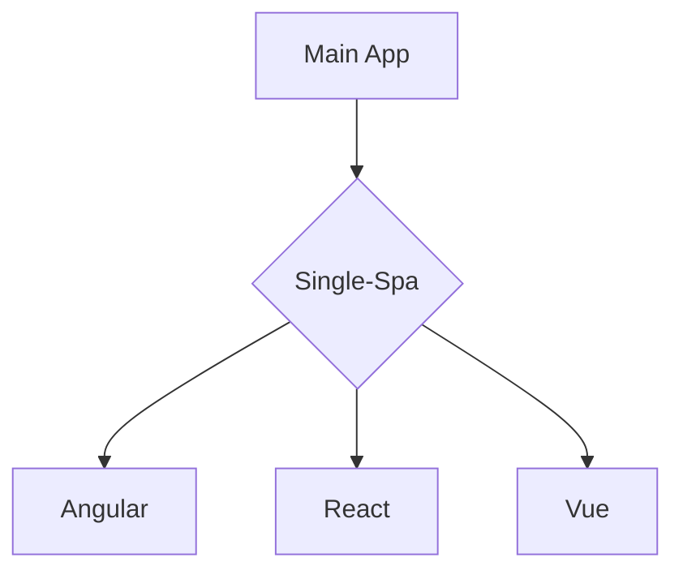
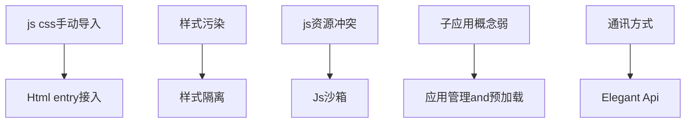

---
# try also 'default' to start simple
theme: seriph
# random image from a curated Unsplash collection by Anthony
# like them? see https://unsplash.com/collections/94734566/slidev
background: https://images.unsplash.com/photo-1620837953336-8274c0623a3c?ixlib=rb-1.2.1&ixid=MnwxMjA3fDB8MHxwaG90by1wYWdlfHx8fGVufDB8fHx8&auto=format&fit=crop&w=2940&q=80
# apply any windi css classes to the current slide
class: 'text-center'
# https://sli.dev/custom/highlighters.html
highlighter: shiki
# show line numbers in code blocks
lineNumbers: false
# some information about the slides, markdown enabled
info: |
  ## Slidev Starter Template
  Presentation slides for developers.

  Learn more at [Sli.dev](https://sli.dev)
# persist drawings in exports and build
drawings:
  persist: false
# use UnoCSS (experimental)
css: unocss
---

# Welcome to Micro-Frontend

Micro Front-end For Monolith Application

<div class="pt-12">
  <span @click="$slidev.nav.next" class="px-2 py-1 rounded cursor-pointer" hover="bg-white bg-opacity-10">
    Press Space for next page <carbon:arrow-right class="inline"/>
  </span>
</div>

<div class="abs-br m-6 flex gap-2">
  <button @click="$slidev.nav.openInEditor()" title="Open in Editor" class="text-xl icon-btn opacity-50 !border-none !hover:text-white">
    <carbon:edit />
  </button>
  <a href="https://github.com/slidevjs/slidev" target="_blank" alt="GitHub"
    class="text-xl icon-btn opacity-50 !border-none !hover:text-white">
    <carbon-logo-github />
  </a>
</div>

<!--

-->

---

# 什么是巨石应用?

- 📝 **Spa-based** - 一般是单页应用的前端项目

- 🎨 **Feature-Rich** - 包含几十个子系统，上千个页面

- 🧑‍💻 **Developer Seperate** - 开发人员属于不同团队

- 🤹 **Part Available For Users** - 用户只会用到部分功能

<br>
<br>


<style>
h1 {
  background-color: #2B90B6;
  background-image: linear-gradient(45deg, #4EC5D4 10%, #146b8c 20%);
  background-size: 100%;
  -webkit-background-clip: text;
  -moz-background-clip: text;
  -webkit-text-fill-color: transparent;
  -moz-text-fill-color: transparent;
}
</style>
<!--
Admin就是典型的巨石应用，
“放入一张Admin的图片”
-->
---

# 巨石应用的痛点

**Like Micro-Servie**

<br>

- 📝 **Spa-based** - 子系统间直接耦合紧密

- 🎨 **Feature-Rich** - 必须使用相同技术栈，引入新技术难，合并其他子系统难

- 🧑‍💻 **Developer Seperate** - 调试难度高，运维成本高

- 🤹 **Indivisual Git Repo** - 受整体拖累，启动运行性能低

- ❎ **Indivisual Git Repo** - 子系统崩溃，影响整个系统


<!--
“放入一张传统应用架构图，横向架构图”
-->

---
layout: two-cols
---
# Why Micro-Front-End

<br>
<br>


::right::

<br>
<br>

- ✅ **Seperate Team Developer** 子系统完全独立，通讯通过基座传递

- ✅ **Indivisual Debug and Publish** 不同技术栈同时存在

- ✅ **Support Different Tech Stack** 独立调试，独立运维，End-to-End测试

- ✅ **Indivisual Code Permission Control** 启动性能仅取决于子系统的复杂度和优化程度

- ✅ **End-To-End Teams** 子系统崩溃，不影响基座&其他子系统

<style>
.footnotes-sep {
  @apply mt-20 opacity-10;
}
.footnotes {
  @apply text-sm opacity-75;
}
.footnote-backref {
  display: none;
}
</style>
<!--
字体小些
-->
---
layout: iframe-left


# the web page source
url: https://mgttest1.yummy.tech/#/

# a custom class name to the content
class: my-cool-content-on-the-left

---

# 举个🌰:
# 直观感受“微前端”是什么样

<br>
<br>
广义微前端：iframe
<br>
<br>
应用：综管平台 -- 基础管理
<br>
<br>

- https://mgttest1.yummy.tech/#/

<style>
  
</style>
<!--
“基础管理”应用，就是一个子系统
是可以独立运行，独立调试，从代码权限到运行时环境于其他系统完全隔离的系统
-->
---
layout: iframe-left

# the web page source
url: https://admintest1.yummy.tech/

# a custom class name to the content
class: my-cool-content-on-the-left
---

# 微前端下多个“子系统”

many **“iframes”** to show the micro-app

```html {all|1|3|5|all}
<sidebar :menu-lists="menuLists" />
<div class="content-container">
  <template v-for="item in iframeUrlList">
    <iframe
      v-show="iframeUrl == item"
      id="app-iframe"
      :key="item"
      allowfullscreen
      :src="item"
      :name="Date.now()"
    />
  </template>
<div/>
```

<arrow v-click="1" x1="400" y1="180" x2="250" y2="80" color="#564" width="3" arrowSize="1" />


<style>
.footnotes-sep {
  @apply mt-20 opacity-10;
}
.footnotes {
  @apply text-sm opacity-75;
}
.footnote-backref {
  display: none;
}
</style>

---
layout: two-cols
---


```js{all|7}
// 初始化平台
async initlatforms() { 
  // 默认取第一个为当前选中平台
  let currentPlatform = { ...firstPlatform } 

  // 省略代码..... 
  const appLists = await this.loadApps(currentPlatform.id)
  this.createHeaderNav({
    currentPlatform,
    appLists,
  })
},
```

```js{all|4|7}
async initApps() {
  let currentApp = appLists[0] || {}
  //省略currentApp 校验逻辑........
  const menuLists = await this.loadMenu(currentApp)

  //侧边栏初始化
  this.createSidebar({ menuLists, app: currentApp })
},
```
::right::


<div class="w-60 relative mt-6">
  <div class="relative w-40 h-40">
    
    
    
  </div>

  <div
    class="text-5xl absolute top-14 left-40 text-[#2B90B6] -z-1"
    v-motion
    :initial="{ x: -80, opacity: 0}"
    :enter="{ x: 0, opacity: 1, transition: { delay: 2000, duration: 1000 } }">
    Slidev
  </div>
</div>

<!-- vue script setup scripts can be directly used in markdown, and will only affects current page -->
<script setup lang="ts">
const final = {
  x: 0,
  y: 0,
  rotate: 0,
  scale: 1,
  transition: {
    type: 'spring',
    damping: 10,
    stiffness: 20,
    mass: 2
  }
}
</script>

<div
  v-motion
  :initial="{ x:35, y: 40, opacity: 0}"
  :enter="{ y: 0, opacity: 1, transition: { delay: 3500 } }">

[Learn More](https://sli.dev/guide/animations.html#motion)

</div>

<!--
总结：广义上看iframe是一种微前端方案，相当于在浏览器内又嵌入了一个小的浏览器
Admin利用这种方式，用较低开发成本完成了初始的微前端架构
admin将每个页面，而不是每个子系统放入iframe中，这就从性能、交互等方面埋下了隐患
-->
---
layout: two-cols
---
### Admin架构图
<br>


::right::

<br>
<br>

```js{all|5-6|9}
SET_IFRAME_URL: (state, path) => {
  let iframeUrl, baseUrl
  // location.hash = 'index?path=' + path
  // 是否是外链
  const reg = new RegExp('(http|https)://')
  if (reg.test(path)) {
    iframeUrl = path
  } else {
    baseUrl = state.currentApp.url
    iframeUrl = baseUrl + path.replace(/\/+/, '')
  }
  if (iframeUrl.indexOf('?') > -1) {
    iframeUrl = iframeUrl + '&token=' + getToken()
  } else {
    iframeUrl = iframeUrl + '?token=' + getToken()
  }

  iframeUrl += '&platform=subview&from=admin&brandMdCode=' + getBrandCode() 

  state.iframeUrl = iframeUrl
  if (state.iframeUrlList.indexOf(iframeUrl) > -1) {
    return
  }
  state.iframeUrlList.push(iframeUrl)
},
```
---

# Why 乾坤

<style>
.slidev-layout{
  position: relative;
  background-image: url(https://images.unsplash.com/photo-1606318005254-bdb2bcd14d34?ixlib=rb-1.2.1&ixid=MnwxMjA3fDB8MHxwaG90by1wYWdlfHx8fGVufDB8fHx8&auto=format&fit=crop&w=1770&q=80);
  background-size: 100%;
}
.slidev-layout h1{
  position: fixed;
  top: 50%;
  left: 55%;
  transform: translateX(-50%) translateY(-50%);
  color: white;

}

</style>
---


#### **iframe方案的痛点**


- 📝 **Performace** - 小浏览器：每个标签页面，都要从头开始加载

- 🎨 **Interaction** - 路由割裂：无法在系统内部启动二级页面，会跳出Admin

- 🧑‍💻 **Style** - DOM不共享：遮罩无法全屏，弹窗无法居中

- 🤹 **Communication** - 内存不共享：通讯困难 扩展性差的通讯方式

- ❎ **Safety** - token等信息易暴露（because of Communication）

<br>

#### **iframe方案的优点**


<br>

- 📝 **Friendly** -  ***对开发者友好：方案简单，快速上线***

<!--
旁边放一个amdin，随时展示
-->

<style>
h4 strong {
  color: blue
}
</style>
---

# Single-Spa 突破性创新

> <carbon-badge />A javascript framework for front-end microservices

<div class="grid grid-cols-3 gap-10 pt-4 -mb-6">




- <u>**Without iframes**</u> 

- <u>**Real Single App**</u> 

- <u>**Excellent Performance**</u> 


</div>

[Learn More](https://sli.dev/guide/syntax.html#diagrams)


---

# 乾坤 --> 完善的解决方案

<br>



<br>

- 💃 Elegant API
- 💪 HTML Entry Access Mode
- 🛡 Style Isolation
- 🧳 JS Sandbox
- ⚡ Prefetch Assets
---

# 乾坤 -> Admin : 实践

<style>
.slidev-layout{
  position: relative;
  background-image: url(https://images.unsplash.com/photo-1589786682914-3e3d2c71ce43?ixlib=rb-1.2.1&ixid=MnwxMjA3fDB8MHxwaG90by1wYWdlfHx8fGVufDB8fHx8&auto=format&fit=crop&w=1770&q=80);
  background-size: 100%;
}
.slidev-layout h1{
  position: fixed;
  top: 50%;
  left: 50%;
  transform: translateX(-50%) translateY(-50%);
  color: yellow;
  font-size: 36px;

}

</style>

---

### 结果：<u>Admin用乾坤改造后：</u> 

<iframe
  class="w-full h-full" src="https://admintest1.yummy.tech/#/">
</iframe>

<!--
click事件，对比两个iframe
分别是admintest1，localhost
从加载速度、router、style样式三方面
<iframe
  class="w-full h-full" src="https://admintest1.yummy.tech/#/">
</iframe>
-->


<div class="mermaid">


</div>

<style>
.mermaid{
  position: fixed;
  top: 60%;
  left: 5%;
}
</style>


---

# 乾坤 官方方案的不足
<br>

- 💪 **多子应用共存** -- 多子应用无法共存，多页签切换时会卸载，无法保持各自状态

- 🛡 **动态注册子应用** -- Qiankun官方子应用是静态注册，Admin是动态获取（不同Platform）

- ⚡ **渐进式改造** -- Admin需要Iframe与Qiankun共存一段时间，

---

# 我们做了哪些？


<div class="relative">

  

  <div class="absolute top-0 left-60%">

  

  <br>

  <div class="w-4 h-4 bg-[#E5CCFF] inline"></div> App1 
  <div class="w-4 h-4 bg-[#D5E8D4] inline"></div> App2
  <div class="w-4 h-4 bg-[#33FF99] inline"></div> App3

  <br>
  <br>
  <br>

  - **iframe** 强隔离

  - **qiankun** 弱隔离

  </div>

</div>

<style>
  .inline{
    display: inline-block;
    margin-right: 10px;
  }
</style>

---

# 我们的工作
<br>

- ⚡ <span>**渐进式改造** -- Admin需要Iframe与Qiankun共存一段时间</span>

- 💪 <span class="color-[#C1C1C1]">**多子应用共存** -- 多子应用无法共存，多页签切换时会卸载，无法保持各自状态</span>

- 🛡 <span class="color-[#C1C1C1]">**动态注册子应用** -- Qiankun官方子应用是静态注册，Admin是动态获取（不同Platform）</span>


---
layout: two-cols
---

### 改造前

```html{4-5}
<tags-view v-if="needTagsView" />
<div v-if="tabPathList.length > 0"
     class="app-container">
  <template v-for="item in iframeUrlList">
    <iframe v-show="iframeUrl == item"
            id="app-iframe"
            :key="item"
            allowfullscreen
            :src="item" />
  </template>
</div>
```


::right::

### 改造后

```html{3,11}
<tags-view v-if="needTagsView" />
<div v-if="tabPathList.length > 0" class="app-container">
  <div v-show="showMicroApp()" style="height: 100%">
    <div
      :id="item.id"
      v-for="item in microAppConfigList"
      :key="item.id"
      v-show="showContainer(item.id)">
    </div>
  </div>
  <div v-show="!showMicroApp()" style="height: 100%">
    <template v-for="item in iframeUrlList">
      <iframe
        v-show="iframeUrl == item"
        id="app-iframe"
        :key="item"
        allowfullscreen
        :src="item"
      />
    </template>
  </div>
  
</div>
```

<style>
.col-left{
  margin-right: 10px;
}
</style>

---

# 我们的工作
<br>

- ⚡ <span class="color-[#C1C1C1]">**渐进式改造** -- Admin需要Iframe与Qiankun共存一段时间</span>

- 🛡 <span>**动态注册子应用** -- Qiankun官方子应用是静态注册，Admin是动态获取（不同Platform）</span>

- 💪 <span class="color-[#C1C1C1]">**多子应用共存** -- 多子应用无法共存，多页签切换时会卸载，无法保持各自状态</span>

---
layout: two-cols
---

##### <span class="color-red">改造前</span>

```js{7,14,21}
export const microAppConfig = [
  {
    id: 'container-1',
    name: 'app1',
    entry:  '/subPages/app1/',
    container: '#container-1',
    activeRule: '/app1'
  },
  {
    id: 'container-2',
    name: 'app2',
    entry:  '/subPages/app2/',
    container: '#container-2',
    activeRule: '/centerProduct'
  },
  {
    id: 'container-3',
    name: 'app3',
    entry:  '/subPages/app3/',
    container: '#container-3',
    activeRule: '/app3'
  }
]
```

::right::

##### <span class="color-red">改造后</span>

```js {3,4|16,19|20}
async loadApps(platformId) {
  const res = await getApps(platformId)
  this.$store.commit('APPEND_MICRO_APP_CONFIGS',
  {appList: res.data})
  if (res.data && res.status === 0) {
    return res.data
  }
},

APPEND_MICRO_APP_CONFIGS: (state, payload) => {
  
  const { appList } = payload
  state.microAppConfigList = appList.reduce((prev, cur) => {
    if (appCodesByQiankun.includes(cur.code)) {
      return prev.concat([{
        id: `container-${cur.id}`,
        name: cur.code,
        entry: cur.url,
        container: `#container-${cur.id}`,
        activeRule: `/${cur.code}`
      }])
    } else {
      return prev
    }

  }, microAppConfigList)
},
```

<!--
getRouters接口返回Route的id，来生成不同的挂载点
Route的appCode作为activeRule，菜单配置path要以activeRule开头
-->

---

# 我们的工作
<br>

- ⚡ <span class="color-[#C1C1C1]">**渐进式改造** -- Admin需要Iframe与Qiankun共存一段时间</span>

- 🛡 <span class="color-[#C1C1C1]">**动态注册子应用** -- Qiankun官方子应用是静态注册，Admin是动态获取（不同Platform）</span>

- 💪 <span>**多子应用共存** -- 多子应用无法共存，多页签切换时会卸载，无法保持各自状态</span>

---
layout: two-cols
---

- **加载应用** 

<kbd>SET_MICRO_APP</kbd>

- **切换应用** 

<kbd>showMicroApp</kbd> & <kbd>showContainer</kbd>

- **删除应用** 

<kbd>CLOSE_SELECTED_TAG</kbd> & <kbd>CLOSE_OTHERS</kbd> & <kbd>CLOSE_ALL</kbd>

::right::


```js{8-19|26}
CLOSE_OTHERS: (state, index) => {
  if (isMicroApp(path, state.microAppConfigList)) {
    // 当前tab是micro-app
    const curMicroApp = findMicroAppByPath(path, state.microAppConfigList)
    Object.keys(state.mountedMicroApp).forEach(appName => {
      const app = state.mountedMicroApp[appName]
      if (app.getStatus() == 'MOUNTED') {
        if (appName != curMicroApp.name) {
          app.unmount()
          delete state.mountedMicroApp[appName]
        } else {
          const retainName = normalizeRouteName(state.tabContentList[0].name)
          app.update({
            routerEvent: {
              name: retainName,
              type: 'closeOthers'
            }
          })
        }
      }
    })
  } else {
    // 当前tab是iframe
    // 所有micro-app 都unmounted
    Object.values(state.mountedMicroApp).forEach(app => {
      if (app.getStatus() == 'MOUNTED') {
        app.unmount()
      }
    })
    state.mountedMicroApp = {}
  }

},
```

---

# 其他的工作

<br>

| 改造点 | 改造前 | 改造后 |
| --- | --- | --- |
| 基座path| <u>#/index?path=%2Fsystem%2Fapp</u> | <u>/#/system/app</u> |
| token共享 | url拼接 | store内存共享 |
| 跳转新页面 | <kbd>window.open</kbd> | <kbd>parentRouter.push</kbd> |
| 容器判断 | <kbd>from=admin&platform=subview</kbd> | <kbd>window.__POWERED_BY_QIANKUN__</kbd> |
| joymo-lib | 不支持缓存 | <kbd>keep-alive</kbd> |
| store | 子系统独立维护 | <kbd>unmount时store.reset()</kbd> |

<style>
  table th {
    color: green;
    font-size: 24px;
  }
</style>

---

<iframe class="w-full h-full" src="https://i7drsi3tvf.feishu.cn/wiki/wikcnUnnJfTF7NpISTmN30A0OPd#doxcnEiEo2GsSqqiQq6PrG4Wb0c"/>