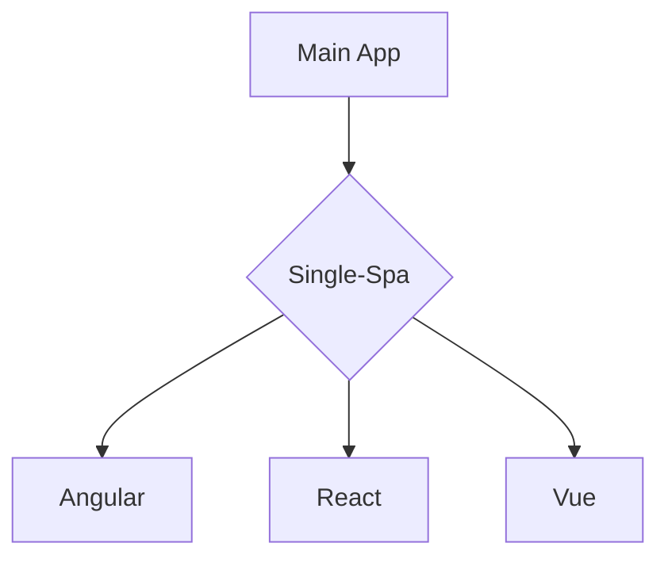
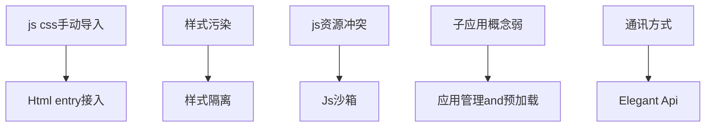

---
# try also 'default' to start simple
theme: seriph
# random image from a curated Unsplash collection by Anthony
# like them? see https://unsplash.com/collections/94734566/slidev
background: https://source.unsplash.com/collection/94734566/1920x1080
# apply any windi css classes to the current slide
class: 'text-center'
# https://sli.dev/custom/highlighters.html
highlighter: shiki
# show line numbers in code blocks
lineNumbers: false
# some information about the slides, markdown enabled
info: |
  ## Slidev Starter Template
  Presentation slides for developers.

  Learn more at [Sli.dev](https://sli.dev)
# persist drawings in exports and build
drawings:
  persist: false
# use UnoCSS (experimental)
css: unocss
---

# 微前端 —— 拆解巨石应用

micro front-end for monolith application

<div class="pt-12">
  <span @click="$slidev.nav.next" class="px-2 py-1 rounded cursor-pointer" hover="bg-white bg-opacity-10">
    Press Space for next page <carbon:arrow-right class="inline"/>
  </span>
</div>

<div class="abs-br m-6 flex gap-2">
  <button @click="$slidev.nav.openInEditor()" title="Open in Editor" class="text-xl icon-btn opacity-50 !border-none !hover:text-white">
    <carbon:edit />
  </button>
  <a href="https://github.com/slidevjs/slidev" target="_blank" alt="GitHub"
    class="text-xl icon-btn opacity-50 !border-none !hover:text-white">
    <carbon-logo-github />
  </a>
</div>

<!--

-->

---

# 什么是巨石应用?

- 📝 **Spa-based** - 一般是单页应用的前端项目

- 🎨 **Feature-Rich** - 包含几十个子系统，上千个页面

- 🧑‍💻 **Developer Seperate** - 开发人员属于不同团队

- 🤹 **Part Available For Users** - 用户只会用到部分功能

<br>
<br>


<style>
h1 {
  background-color: #2B90B6;
  background-image: linear-gradient(45deg, #4EC5D4 10%, #146b8c 20%);
  background-size: 100%;
  -webkit-background-clip: text;
  -moz-background-clip: text;
  -webkit-text-fill-color: transparent;
  -moz-text-fill-color: transparent;
}
</style>
<!--
Admin就是典型的巨石应用，
“放入一张Admin的图片”
-->
---

# 巨石应用的痛点

**Like Micro-Servie**

<br>

- 📝 **Spa-based** - 子系统间直接耦合紧密

- 🎨 **Feature-Rich** - 必须使用相同技术栈，引入新技术难，合并其他子系统难

- 🧑‍💻 **Developer Seperate** - 调试难度高，运维成本高

- 🤹 **Indivisual Git Repo** - 受整体拖累，启动运行性能低

- ❎ **Indivisual Git Repo** - 子系统崩溃，影响整个系统


<!--
“放入一张传统应用架构图，横向架构图”
-->

---
layout: two-cols
---
# Why Micro-Front-End

<br>
<br>


::right::

<br>
<br>

- ✅ **Seperate Team Developer** 子系统完全独立，通讯通过基座传递

- ✅ **Indivisual Debug and Publish** 不同技术栈同时存在

- ✅ **Support Different Tech Stack** 独立调试，独立运维，End-to-End测试

- ✅ **Indivisual Code Permission Control** 启动性能仅取决于子系统的复杂度和优化程度

- ✅ **End-To-End Teams** 子系统崩溃，不影响基座&其他子系统

<style>
.footnotes-sep {
  @apply mt-20 opacity-10;
}
.footnotes {
  @apply text-sm opacity-75;
}
.footnote-backref {
  display: none;
}
</style>
<!--
字体小些
-->
---
layout: iframe-left


# the web page source
url: https://mgttest1.yummy.tech/#/

# a custom class name to the content
class: my-cool-content-on-the-left

---

# 举个🌰:
# 究竟“微前端”是什么样

<br>
<br>
广义微前端：iframe
<br>
<br>
应用：综管平台 -- 基础管理
<br>
<br>

- https://mgttest1.yummy.tech/#/

<style>
  
</style>
<!--
“基础管理”应用，就是一个子系统
是可以独立运行，独立调试，从代码权限到运行时环境于其他系统完全隔离的系统
-->
---
layout: iframe-left

# the web page source
url: https://admintest1.yummy.tech/

# a custom class name to the content
class: my-cool-content-on-the-left
---

# 微前端下多个“子系统”

many **“iframes”** to show the micro-app

```html {all|1|3|5|all}
<sidebar :menu-lists="menuLists" />
<div class="content-container">
  <template v-for="item in iframeUrlList">
    <iframe
      v-show="iframeUrl == item"
      id="app-iframe"
      :key="item"
      allowfullscreen
      :src="item"
      :name="Date.now()"
    />
  </template>
<div/>
```

<arrow v-click="1" x1="400" y1="180" x2="250" y2="80" color="#564" width="3" arrowSize="1" />


<style>
.footnotes-sep {
  @apply mt-20 opacity-10;
}
.footnotes {
  @apply text-sm opacity-75;
}
.footnote-backref {
  display: none;
}
</style>

---
layout: two-cols
---


```js{all|7}
// 初始化平台
async initlatforms() { 
  // 默认取第一个为当前选中平台
  let currentPlatform = { ...firstPlatform } 

  // 省略代码..... 
  const appLists = await this.loadApps(currentPlatform.id)
  this.createHeaderNav({
    currentPlatform,
    appLists,
  })
},
```

```js{all|4|7}
async initApps() {
  let currentApp = appLists[0] || {}
  //省略currentApp 校验逻辑........
  const menuLists = await this.loadMenu(currentApp)

  //侧边栏初始化
  this.createSidebar({ menuLists, app: currentApp })
},
```
::right::


<div class="w-60 relative mt-6">
  <div class="relative w-40 h-40">
    
    
    
  </div>

  <div
    class="text-5xl absolute top-14 left-40 text-[#2B90B6] -z-1"
    v-motion
    :initial="{ x: -80, opacity: 0}"
    :enter="{ x: 0, opacity: 1, transition: { delay: 2000, duration: 1000 } }">
    Slidev
  </div>
</div>

<!-- vue script setup scripts can be directly used in markdown, and will only affects current page -->
<script setup lang="ts">
const final = {
  x: 0,
  y: 0,
  rotate: 0,
  scale: 1,
  transition: {
    type: 'spring',
    damping: 10,
    stiffness: 20,
    mass: 2
  }
}
</script>

<div
  v-motion
  :initial="{ x:35, y: 40, opacity: 0}"
  :enter="{ y: 0, opacity: 1, transition: { delay: 3500 } }">

[Learn More](https://sli.dev/guide/animations.html#motion)

</div>

<!--
总结：广义上看iframe是一种微前端方案，相当于在浏览器内又嵌入了一个小的浏览器
Admin利用这种方式，用较低开发成本完成了初始的微前端架构
admin将每个页面，而不是每个子系统放入iframe中，这就从性能、交互等方面埋下了隐患
-->
---
layout: two-cols
---
### Admin架构图
<br>


::right::

<br>
<br>

```js{all|5-6|9}
SET_IFRAME_URL: (state, path) => {
  let iframeUrl, baseUrl
  // location.hash = 'index?path=' + path
  // 是否是外链
  const reg = new RegExp('(http|https)://')
  if (reg.test(path)) {
    iframeUrl = path
  } else {
    baseUrl = state.currentApp.url
    iframeUrl = baseUrl + path.replace(/\/+/, '')
  }
  if (iframeUrl.indexOf('?') > -1) {
    iframeUrl = iframeUrl + '&token=' + getToken()
  } else {
    iframeUrl = iframeUrl + '?token=' + getToken()
  }

  iframeUrl += '&platform=subview&from=admin&brandMdCode=' + getBrandCode() 

  state.iframeUrl = iframeUrl
  if (state.iframeUrlList.indexOf(iframeUrl) > -1) {
    return
  }
  state.iframeUrlList.push(iframeUrl)
},
```
---

# Why 乾坤

#### **iframe方案的痛点**


- 📝 **Performace** - 小浏览器：每个标签页面，都要从头开始加载

- 🎨 **Interaction** - 路由割裂：无法在系统内部启动二级页面，会跳出Admin

- 🧑‍💻 **Style** - DOM不共享：遮罩无法全屏，弹窗无法居中

- 🤹 **Communication** - 内存不共享：通讯困难 扩展性差的通讯方式

- ❎ **Safety** - token等信息易暴露（because of Communication）

<br>

#### **iframe方案的优点**


<br>

- 📝 **Friendly** -  ***对开发者友好：方案简单，快速上线***

<!--
旁边放一个amdin，随时展示
-->

<style>
h4 strong {
  color: blue
}
</style>
---

# Single-Spa 突破性创新

> <carbon-badge />A javascript framework for front-end microservices

<div class="grid grid-cols-3 gap-10 pt-4 -mb-6">




- <u>**Without iframes**</u> 

- <u>**Real Single App**</u> 

- <u>**Excellent Performance**</u> 


</div>

[Learn More](https://sli.dev/guide/syntax.html#diagrams)


---

# 乾坤 --> 完善的解决方案

<br>



<br>

- 💃 Elegant API
- 💪 HTML Entry Access Mode
- 🛡 Style Isolation
- 🧳 JS Sandbox
- ⚡ Prefetch Assets

---
# 乾坤 官方方案的不足
<br>
- 💪 **多子应用共存** -- 多子应用无法共存，多页签切换时会卸载，无法保持各自状态

- 🛡 **动态注册子应用** -- Qiankun官方子应用是静态注册，Admin是动态获取（不同Platform）

- ⚡ **渐进式改造** -- Admin需要Iframe与Qiankun共存一段时间，

