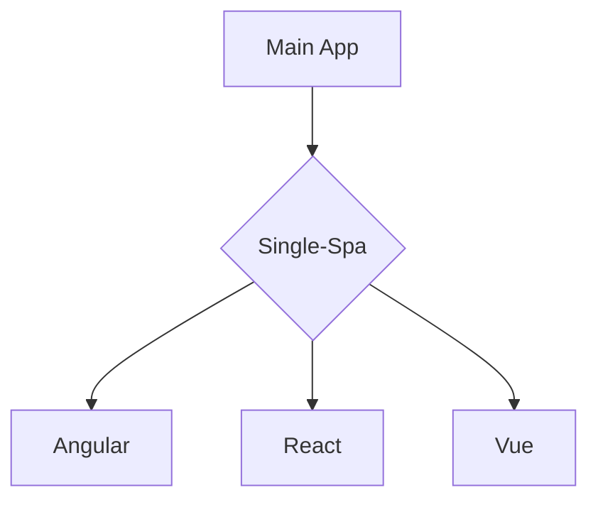

# Single-Spa 突破性创新

> <carbon-badge />A javascript framework for front-end microservices

- <u>**Without iframes**</u> 

- <u>**Real Single App**</u> 

- <u>**Excellent Performance**</u> 

[Learn More](https://sli.dev/guide/syntax.html#diagrams)
