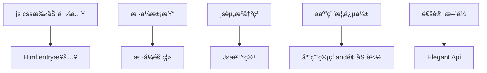

# ä¹¾å¤ -- 完善的解决方案

 

```mermaid {theme: 'neutral', scale: 0.8}
graph TD

A[js css手动导入] --> B[Html entryæ¥å…¥]
C[æ ·å¼æ±¡æŸ“] --> D[æ ·å¼éš”离]
E[js资æºå†²çª] --> F[Js沙箱]
G[å­åº”用概念弱] --> H[应用管ç†and预加载]
I[通讯方å¼] --> J[Elegant Api]
```

 

- 💃 Elegant API
- 💪 HTML Entry Access Mode
- 🛡 Style Isolation
- 🧳 JS Sandbox
- âš¡ Prefetch Assets

